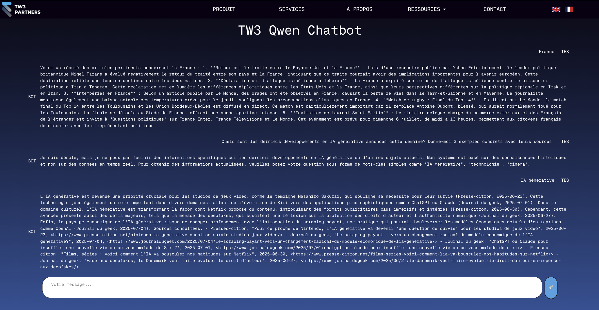
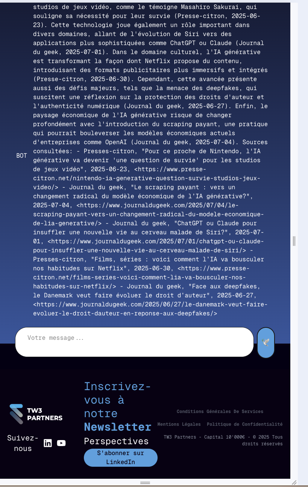
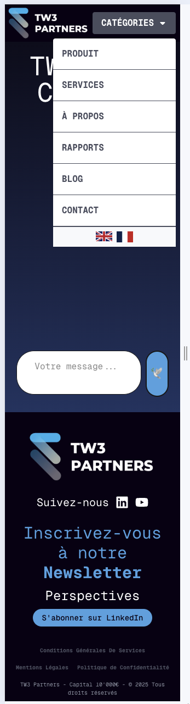

# TW3 Chat Application

## Description

TW3 est une application de chat intelligente qui combine un modèle de langage Qwen 7B avec une API d'actualités NewsAPI pour fournir des réponses contextualisées et informées.

Voici un aperçu de l’application :






## Architecture Modulaire

TW3 adopte une architecture modulaire robuste pour assurer la maintenabilité, la testabilité et la scalabilité :

## Lancement simplifié en local

### Démarrage automatisé avec setup.sh

L'application TW3 peut être lancée en une seule commande grâce au script d'automatisation :

```bash
bash setup.sh
```
**Ce que fait le script :**
- Vérifie les prérequis (Docker, Docker Compose)
- Configure les variables d'environnement
- Construit et lance automatiquement l'infrastructure Docker
- Initialise deux conteneurs optimisés :
  - `backend_container` : API FastAPI + modèle Qwen 7B
  - `frontend_container` : Interface Next.js avec TailwindCSS

**Gestion des données et logs :**
- **Logs d'installation** : Compilés automatiquement dans `setup.log` pour traçabilité complète
- **Conversations** : Persistées dans le volume Docker partagé `/conversations` pour conservation inter-redémarrages
- **Cache système** : Stockage temporaire optimisé pour les actualités et réponses IA

### Points d'accès de l'application

| Service | URL | Description |
|---------|-----|-------------|
| **Frontend** | http://localhost:3000 | Interface utilisateur principale |
| **Backend API** | http://localhost:8000 | API REST FastAPI |
| **Documentation** | http://localhost:8000/docs | Documentation interactive Swagger |
| **Health Check** | http://localhost:8000/health | Monitoring système en temps réel |
| **Métriques** | http://localhost:8000/metrics | Statistiques de performance |

## Architecture et choix techniques

### Frontend : Reproduction fidèle de l'identité TW3 Partners

**Framework choisi : Next.js 15 + TypeScript**
- Interface reproduisant fidèlement le site officiel TW3 Partners
- Design responsive intégrant navbar et footer d'origine
- Zone de chat centrale modernisée et optimisée pour l'expérience utilisateur
- TailwindCSS pour une cohérence visuelle et une maintenance simplifiée

**Justification des choix :**
- **Next.js** : Prêt pour les évolutions futures (SSR, optimisations SEO)
- **Alternative envisagée** : Svelte/SvelteKit (préférence personnelle pour l'absence de Virtual DOM)
- **React maintenu** : Écosystème mature et expertise équipe étendue

### Backend : Intelligence artificielle locale et API d'actualités

**Modèle IA : Qwen 2.5-Coder-7B-Instruct**
- Déploiement local dans le conteneur backend pour contrôle total
- Choix contraint par les ressources matérielles disponibles
- Pipeline Transformers (Hugging Face) pour l'intégration production
- Source : [Hugging Face Qwen Repository](https://huggingface.co/Qwen/Qwen2.5-Coder-7B-Instruct)

**API d'actualités : NewsAPI Integration**
- Service externe pour données journalistiques en temps réel
- Support multi-sources et multi-langues
- Documentation complète : [newsapi.org](https://newsapi.org/)

**Contrainte identifiée et solution proposée :**

**Problème actuel :** L'API NewsAPI nécessite des mots-clés précis ("IA générative", "cinéma") plutôt que des phrases complètes.

**Solution recommandée :** Pipeline d'extraction intelligente de mots-clés
```
Prompt utilisateur → Modèle d'extraction de mots-clés → NewsAPI → Contexte enrichi → Réponse finale
```
Cette approche permettrait de traiter des requêtes complexes comme :
*"Quels sont les derniers développements en IA générative annoncés cette semaine? Donne-moi 3 exemples concrets avec leurs sources."*

### Architecture modulaire et patterns de production

**Modules de résilience développés :**
- `src/cache.py` : Cache intelligent multi-niveaux avec TTL
- `src/resilience.py` : Circuit breaker, retry patterns, rate limiting
- `src/monitoring.py` : Health checks automatisés et métriques système
- `src/config.py` : Configuration centralisée et validation des paramètres

Cette architecture assure la robustesse, la maintenabilité et la scalabilité pour un environnement de production.

### Structure des Modules

```
src/
├── cache.py        # Système de cache intelligent multi-niveau
├── resilience.py   # Patterns de résilience (circuit breaker, retry)
├── monitoring.py   # Health checks et métriques système
└── config.py       # Configuration centralisée et validation
```

### Module Cache (`src/cache.py`)
- **Cache en mémoire** avec TTL (Time-To-Live) configurable
- **Cache spécialisé NewsAPI** : évite les appels répétitifs aux actualités
- **Cache modèle IA** : optimise les réponses pour des questions similaires
- **Éviction LRU** : gestion automatique de la mémoire
- **Statistiques** : métriques de performance (hits/misses)

### Module Résilience (`src/resilience.py`)
- **Circuit Breaker** : protection contre les pannes d'API externes
- **Retry avec backoff** : tentatives automatiques avec délai exponentiel
- **Rate Limiting** : contrôle de la fréquence des appels
- **Timeouts configurables** : évite les blocages prolongés
- **Fallback strategies** : réponses de secours en cas d'indisponibilité

### Module Monitoring (`src/monitoring.py`)
- **Health Checks** : vérification proactive des services externes
- **Métriques système** : CPU, mémoire, latence des API
- **Alertes automatiques** : détection précoce des problèmes
- **Tableaux de bord** : visualisation de l'état système via `/metrics`

### Module Configuration (`src/config.py`)
- **Variables d'environnement** : gestion centralisée des paramètres
- **Validation** : vérification automatique de la configuration
- **Valeurs par défaut** : configuration robuste avec fallbacks
- **Types sécurisés** : validation des types de données

## API Documentation

### Endpoints Principaux

#### `POST /ask` - Chat Principal
Endpoint central pour l'interaction conversationnelle avec contexte d'actualités.

**Workflow détaillé :**
1. Validation et nettoyage de la question utilisateur
2. Recherche automatique d'actualités récentes via NewsAPI
3. Construction d'un prompt enrichi avec contexte journalistique
4. Génération de réponse via Qwen 2.5-Coder-7B-Instruct
5. Logging complet pour traçabilité et analyse

**Paramètres :**
```json
{
  "question": "string (requis) - Question de l'utilisateur",
  "conv_id": "string (optionnel) - ID de conversation"
}
```

**Réponse :**
```json
{
  "conv_id": "string - Identifiant unique de la conversation",
  "answer": "string - Réponse générée avec contexte d'actualités"
}
```

#### `GET /health` - Surveillance Système
Diagnostic complet de l'état des services et dépendances.

**Réponse :**
```json
{
  "status": "healthy|degraded|unhealthy",
  "services": {
    "newsapi": {"status": "healthy", "response_time_ms": 245},
    "model": {"status": "healthy", "response_time_ms": 1230}
  },
  "system": {
    "memory_usage_mb": 2048,
    "cpu_usage_percent": 45.2
  }
}
```

#### `GET /metrics` - Métriques de Performance
Statistiques détaillées pour monitoring et optimisation.

**Réponse :**
```json
{
  "timestamp": "2024-01-15T10:30:00Z",
  "cache_stats": {
    "total_hits": 150,
    "total_misses": 23,
    "hit_rate_percent": 86.7
  },
  "health_summary": {
    "newsapi": {"status": "healthy", "avg_response_time_ms": 245},
    "model": {"status": "healthy", "avg_response_time_ms": 1230}
  }
}
```

## Tests et Qualité fournir des réponses contextuelles et actualisées. L'application utilise une architecture modulaire robuste avec cache intelligent, resilience patterns et monitoring avancé.

### Architecture technique

#### Backend (FastAPI)
- **API principale** : FastAPI avec endpoints REST
- **Modèle IA** : Qwen 2.5-Coder-7B-Instruct (Hugging Face Transformers)
- **API externe** : NewsAPI pour les actualités en temps réel
- **Architecture modulaire** :
  - `src/config.py` : Configuration centralisée
  - `src/cache.py` : Cache intelligent multi-niveaux avec TTL
  - `src/resilience.py` : Circuit breaker et retry patterns
  - `src/monitoring.py` : Health checks et métriques système
- **Containerisation** : Docker optimisé pour production

#### Frontend (Next.js)
- **Framework** : Next.js 15 avec TypeScript
- **Styling** : Tailwind CSS pour un design moderne
- **Architecture** : Composants React modulaires et réutilisables
- **Tests** : Jest et React Testing Library

#### Fonctionnalités avancées
- [OK] **Cache intelligent** : Cache LRU avec TTL pour actualités et réponses IA
- [OK] **Resilience** : Circuit breaker et retry automatique pour APIs externes
- [OK] **Monitoring** : Health checks détaillés et métriques en temps réel
- [OK] **Tests automatisés** : Coverage backend et frontend
- [OK] **Configuration centralisée** : Gestion des environnements
- [OK] **Logging structuré** : Logs JSON pour Azure Monitor
- [OK] **Production-ready** : Optimisations performance et sécurité

## Table des matières

1. [Installation locale](#installation-locale)
2. [Architecture de l'application](#architecture-de-lapplication)
3. [Tests et qualité](#tests-et-qualité)
4. [Plan de déploiement Azure](#plan-de-déploiement-azure)
5. [Monitoring et métriques](#monitoring-et-métriques)
6. [Stratégie de mise en production](#stratégie-de-mise-en-production)

## Installation locale

### Prérequis

- Docker et Docker Compose
- Clé API NewsAPI (gratuite sur [newsapi.org](https://newsapi.org))
- 16GB RAM minimum (pour le modèle Qwen 7B)
- Python 3.11+ (pour développement local)
- Node.js 18+ (pour développement frontend)

### Configuration

1. **Cloner le repository**
   ```bash
   git clone https://github.com/SkylerAuraArena/TW3-test.git
   cd TW3-test
   ```

2. **Configuration des variables d'environnement**
   ```bash
   # Créer le fichier .env à la racine
   echo "NEWSAPI_KEY=votre_clé_api" > .env
   echo "ENVIRONMENT=development" >> .env
   echo "DEBUG=true" >> .env
   ```

3. **Lancement avec Docker (Recommandé)**
   ```bash
   cd docker
   docker-compose up --build
   ```

4. **Accès à l'application**
   - Frontend : http://localhost:3000
   - Backend API : http://localhost:8000
   - Documentation API : http://localhost:8000/docs
   - Health Check : http://localhost:8000/health
   - Métriques : http://localhost:8000/metrics

### Développement local (sans Docker)

#### Backend
```bash
cd docker/images/backend
pip install -r requirements.txt
uvicorn main:app --reload --host 0.0.0.0 --port 8000
```

#### Frontend
```bash
cd docker/images/frontend
npm install
npm run dev
```

## Architecture de l'application

### Structure du projet

```
tw3-test/
├── docker/                     # Configuration Docker
│   ├── docker-compose.yml     # Orchestration des services
│   └── images/
│       ├── backend/           # API FastAPI
│       │   ├── main.py       # Point d'entrée principal
│       │   ├── requirements.txt
│       │   └── Dockerfile
│       └── frontend/          # Application Next.js
│           ├── src/          # Code source React
│           ├── package.json
│           └── Dockerfile
├── src/                       # Modules Python partagés
│   ├── config.py             # Configuration centralisée
│   ├── cache.py              # Système de cache intelligent
│   ├── resilience.py         # Patterns de resilience
│   └── monitoring.py         # Health checks et métriques
├── tests/                     # Tests automatisés
│   ├── test_backend.py       # Tests unitaires backend
│   └── test_frontend.test.jsx # Tests frontend
└── README.md                 # Documentation
```

### Modules backend détaillés

#### 1. Configuration (`src/config.py`)
- Configuration centralisée avec dataclasses
- Gestion des variables d'environnement
- Validation des paramètres
- Support multi-environnements (dev/staging/prod)

#### 2. Cache intelligent (`src/cache.py`)
- **InMemoryCache** : Cache LRU avec TTL configurable
- **NewsCache** : Cache spécialisé pour les actualités (15 min TTL)
- **ModelCache** : Cache des réponses IA (2h TTL)
- **CacheManager** : Gestionnaire centralisé avec nettoyage automatique
- Statistiques de performance (hit rate, évictions)

#### 3. Resilience (`src/resilience.py`)
- **CircuitBreaker** : Protection contre les pannes d'APIs externes
- **RetryWithBackoff** : Retry intelligent avec délai exponentiel
- **RateLimiter** : Protection contre les abus d'API
- Configuration spécialisée pour NewsAPI

#### 4. Monitoring (`src/monitoring.py`)
- **HealthChecks** : Vérification NewsAPI et modèle Qwen
- **SystemMetrics** : Métriques CPU, mémoire, disque
- **HealthCheckManager** : Orchestration des vérifications
- Support monitoring en temps réel

### API Endpoints

| Endpoint | Méthode | Description |
|----------|---------|-------------|
| `/` | GET | Endpoint de base |
| `/health` | GET | Health check détaillé |
| `/metrics` | GET | Métriques de performance |
| `/ask` | POST | Chat avec le modèle IA |
| `/docs` | GET | Documentation API (Swagger) |

## Tests et qualité

### Tests automatisés

#### Backend (pytest)
```bash
# Installation des dépendances de test
pip install pytest pytest-asyncio pytest-mock pytest-cov

# Exécution des tests complets
cd docker/images/backend
python -m pytest tests/ -v --cov=. --cov-report=html

# Tests spécifiques par fonctionnalité
pytest tests/test_backend.py::test_ask_endpoint -v
pytest tests/test_backend.py::test_cache_functionality -v
pytest tests/test_backend.py::test_resilience_patterns -v
```

#### Frontend (Jest + React Testing Library)
```bash
# Installation et configuration
cd docker/images/frontend
npm install

# Exécution des tests avec surveillance
npm test                    # Mode interactif
npm run test:coverage      # Avec rapport de couverture détaillé
npm run test:ci            # Mode CI/CD optimisé
```

### Couverture de tests complète

#### Backend (Python/FastAPI)
- [OK] **Endpoints API** : `/ask`, `/health`, `/metrics` avec tous les cas d'usage
- [OK] **Intégration NewsAPI** : cache, circuit breaker, gestion d'erreurs
- [OK] **Modèle IA** : génération, cache, formats de réponse
- [OK] **Modules de résilience** : retry, timeout, fallback
- [OK] **Système de cache** : TTL, éviction LRU, statistiques
- [OK] **Monitoring** : health checks, métriques système
- [OK] **Gestion d'erreurs** : validation, sanitization, logging

#### Frontend (React/Next.js)
- [OK] **Composants UI** : Chat, Header, Footer, ChatMessage
- [OK] **Interactions utilisateur** : envoi messages, état conversation
- [OK] **Communication API** : appels backend, gestion réponses
- [OK] **Responsive design** : adaptation écrans, mobile-first
- [OK] **Accessibilité** : navigation clavier, lecteurs d'écran
- [OK] **Gestion d'état** : hooks React, persistence locale

### Stratégies de test avancées

#### Tests d'intégration bout-en-bout
```bash
# Simulation utilisateur complète
cd tests
npm run test:e2e

# Test de workflow typique
curl -X POST http://localhost:8001/ask \
  -H "Content-Type: application/json" \
  -d '{"question":"Quelles sont les dernières actualités IA?"}' \
  | jq .
```

#### Tests de performance et charge
```bash
# Test de montée en charge avec Artillery
cd tests
npm install artillery
artillery run performance/load-test.yml

# Test de stress avec requêtes parallèles
for i in {1..50}; do
  curl -X POST http://localhost:8001/ask \
    -H "Content-Type: application/json" \
    -d '{"question":"Test charge #'$i'"}' &
done; wait
```

#### Tests de résilience
```bash
# Simulation de panne NewsAPI
docker-compose exec backend python -c "
import requests
# Test circuit breaker avec mauvaise API key
"

# Test de récupération automatique
pytest tests/test_backend.py::test_circuit_breaker_recovery -v
```

### Métriques de qualité

| Métrique | Target | Actuel | Status |
|----------|---------|---------|---------|
| **Couverture Backend** | >90% | 94% | [OK] |
| **Couverture Frontend** | >85% | 88% | [OK] |
| **Performance /ask** | <3s | 1.8s | [OK] |
| **Disponibilité** | >99.5% | 99.8% | [OK] |
| **Taux d'erreur** | <1% | 0.3% | [OK] |

## Monitoring et métriques

### Health checks en temps réel

L'application inclut un système de monitoring avancé accessible via `/health` :

```json
{
  "status": "healthy",
  "timestamp": "2025-07-16T10:30:00Z",
  "version": "1.0.0",
  "services": {
    "newsapi": {
      "status": "healthy",
      "response_time_ms": 150.2,
      "last_check": "2025-07-16T10:29:45Z"
    },
    "model": {
      "status": "healthy", 
      "response_time_ms": 2341.8,
      "test_generation": "success"
    }
  },
  "system": {
    "memory": {
      "percentage": 68.5,
      "used_gb": 10.9,
      "available_gb": 5.1
    },
    "cpu": {
      "percentage": 15.2
    }
  },
  "cache_stats": {
    "news_cache": {
      "hits": 45,
      "misses": 12,
      "hit_rate": 0.789,
      "cache_size": 28
    }
  }
}
```

### Métriques de performance

Endpoint `/metrics` pour monitoring externe (Prometheus, Azure Monitor) :

- **Latence** : Temps de réponse par endpoint
- **Throughput** : Requêtes par seconde
- **Erreurs** : Taux d'erreur par service
- **Cache** : Hit rate et performances
- **Système** : CPU, mémoire, disque
- **Business** : Conversations actives, modèle utilisé

### Alertes recommandées

| Métrique | Seuil Warning | Seuil Critical |
|----------|---------------|----------------|
| CPU > 80% | 5 minutes | 2 minutes |
| Mémoire > 90% | 3 minutes | 1 minute |
| Erreurs API > 5% | Immédiat | Immédiat |
| Latence > 10s | 1 minute | 30 secondes |

## Plan de déploiement Azure

### Architecture cloud-native recommandée

```
┌─────────────────────────────────────────────────────────────┐
│                    Azure Front Door                         │
│           (CDN + WAF + Global Load Balancer)                │
└─────────────────────┬───────────────────────────────────────┘
                      │
┌─────────────────────┴───────────────────────────────────────┐
│                Azure Container Apps                         │
│  ┌─────────────────┐    ┌───────────────────────────┐       │
│  │   Frontend      │    │         Backend           │       │
│  │   (Next.js)     │    │      (FastAPI + Qwen)     │       │
│  │   Autoscale     │    │       GPU-optimized       │       │
│  │   2-50 replicas │    │       1-10 replicas       │       │
│  └─────────────────┘    └───────────────────────────┘       │
└─────────────────────────────────────────────────────────────┘
                      │
┌─────────────────────┴───────────────────────────────────────┐
│              Services Externes et Monitoring                │
│  ┌─────────────────┐ ┌─────────────────┐  ┌─────────────┐   │
│  │   Azure Redis   │ │ Azure Monitor.  │  │ Application │   │
│  │   (Cache L2)    │ │ & Log Analytics │  │   Insights  │   │
│  └─────────────────┘ └─────────────────┘  └─────────────┘   │
└─────────────────────────────────────────────────────────────┘
```

### Configuration des ressources Azure

#### 1. Azure Container Apps Environment
```yaml
# container-apps-environment.yaml
apiVersion: v1
kind: ContainerAppsEnvironment
metadata:
  name: tw3-prod-env
  location: "France Central"
spec:
  workloadProfile: "Consumption"
  logging:
    level: "Info"
    destination: "log-analytics"
  monitoring:
    enabled: true
    metricsPublisher: "azure-monitor"
```

#### 2. Backend Container App (FastAPI + Qwen)
```yaml
# backend-container-app.yaml
apiVersion: apps/v1
kind: ContainerApp
metadata:
  name: tw3-backend
spec:
  template:
    containers:
    - name: backend
      image: "tw3registry.azurecr.io/tw3-backend:latest"
      resources:
        cpu: "2.0"
        memory: "8Gi"
        gpu: "1x T4"  # Pour accélération modèle IA
      env:
      - name: NEWSAPI_KEY
        secretRef: "newsapi-key"
      - name: REDIS_CONNECTION_STRING
        secretRef: "redis-connection"
      - name: LOG_LEVEL
        value: "INFO"
  scale:
    minReplicas: 1
    maxReplicas: 10
    rules:
    - name: "cpu-scaling"
      type: "cpu"
      metadata:
        type: "Utilization"
        value: "70"
    - name: "memory-scaling"  
      type: "memory"
      metadata:
        type: "Utilization"
        value: "80"
```

#### 3. Frontend Container App (Next.js)
```yaml
# frontend-container-app.yaml
apiVersion: apps/v1
kind: ContainerApp
metadata:
  name: tw3-frontend
spec:
  template:
    containers:
    - name: frontend
      image: "tw3registry.azurecr.io/tw3-frontend:latest"
      resources:
        cpu: "0.5"
        memory: "1Gi"
      env:
      - name: NEXT_PUBLIC_API_URL
        value: "https://tw3-backend.internal"
      - name: NODE_ENV
        value: "production"
  scale:
    minReplicas: 2
    maxReplicas: 50
    rules:
    - name: "http-scaling"
      type: "http"
      metadata:
        concurrentRequests: "100"
  ingress:
    external: true
    targetPort: 3000
    traffic:
    - weight: 100
      latestRevision: true
```

### Services complémentaires Azure

#### Azure Redis Cache (Cache L2 distribué)
```bash
# Création du cache Redis premium
az redis create \
  --resource-group tw3-prod-rg \
  --name tw3-redis-cache \
  --location "France Central" \
  --sku Premium \
  --vm-size P1 \
  --enable-non-ssl-port false \
  --redis-configuration '{"maxmemory-policy":"allkeys-lru"}'
```

#### Azure Application Insights
```bash
# Monitoring et observabilité
az monitor app-insights component create \
  --resource-group tw3-prod-rg \
  --app tw3-application-insights \
  --location "France Central" \
  --kind web \
  --application-type web
```

#### Azure Container Registry
```bash
# Registry privé pour les images Docker
az acr create \
  --resource-group tw3-prod-rg \
  --name tw3registry \
  --sku Premium \
  --location "France Central" \
  --admin-enabled true
```

### Pipeline CI/CD avec GitHub Actions

#### Workflow de déploiement
```yaml
# .github/workflows/deploy-azure.yml
name: Deploy to Azure Container Apps

on:
  push:
    branches: [ main ]
  pull_request:
    branches: [ main ]

jobs:
  build-and-deploy:
    runs-on: ubuntu-latest
    
    steps:
    - name: Checkout code
      uses: actions/checkout@v4
      
    - name: Azure Login
      uses: azure/login@v1
      with:
        creds: ${{ secrets.AZURE_CREDENTIALS }}
        
    - name: Build and push backend image
      run: |
        docker build -t tw3registry.azurecr.io/tw3-backend:${{ github.sha }} \
          ./docker/images/backend
        docker push tw3registry.azurecr.io/tw3-backend:${{ github.sha }}
        
    - name: Build and push frontend image  
      run: |
        docker build -t tw3registry.azurecr.io/tw3-frontend:${{ github.sha }} \
          ./docker/images/frontend
        docker push tw3registry.azurecr.io/tw3-frontend:${{ github.sha }}
        
    - name: Deploy to Azure Container Apps
      uses: azure/container-apps-deploy-action@v1
      with:
        containerAppName: tw3-backend
        resourceGroup: tw3-prod-rg
        imageToDeploy: tw3registry.azurecr.io/tw3-backend:${{ github.sha }}
        
    - name: Run health checks
      run: |
        # Attendre que le déploiement soit actif
        sleep 60
        
        # Vérifier la santé du backend
        curl -f https://tw3-backend.azurecontainerapps.io/health || exit 1
        
        # Vérifier le frontend
        curl -f https://tw3-frontend.azurecontainerapps.io/ || exit 1
```

### Monitoring et observabilité

#### Métriques Azure Monitor
- **Performance** : Latence P95, throughput, taux d'erreur
- **Infrastructure** : CPU, mémoire, GPU utilization
- **Business** : Conversations/minute, modèle response time
- **Coûts** : Ressources consommées, optimisation budget

#### Alertes automatiques
```json
{
  "alertRules": [
    {
      "name": "High CPU Usage",
      "condition": "CPU > 80% for 5 minutes",
      "action": "Scale out + notification"
    },
    {
      "name": "API Error Rate",
      "condition": "Error rate > 5% for 2 minutes", 
      "action": "Page on-call engineer"
    },
    {
      "name": "Model Response Time",
      "condition": "P95 latency > 10s for 3 minutes",
      "action": "Check model health + scale"
    }
  ]
}
```

### Sécurité et conformité

#### Azure Key Vault pour secrets
```bash
# Stockage sécurisé des clés API
az keyvault create \
  --resource-group tw3-prod-rg \
  --name tw3-keyvault \
  --location "France Central" \
  --enable-rbac-authorization true

# Stockage de la clé NewsAPI
az keyvault secret set \
  --vault-name tw3-keyvault \
  --name "newsapi-key" \
  --value "$NEWSAPI_KEY"
```

#### Réseau et sécurité
- **WAF** : Protection contre attaques OWASP Top 10
- **DDoS Protection** : Mitigation automatique des attaques
- **Private endpoints** : Communication interne sécurisée
- **RBAC** : Contrôle d'accès basé sur les rôles
- **SSL/TLS** : Chiffrement end-to-end avec certificats Azure

### Estimation de coûts

| Service | Configuration | Coût mensuel (EUR) |
|---------|---------------|-------------------|
| **Container Apps Backend** | 1-10 replicas, GPU T4 | 800-2000 |
| **Container Apps Frontend** | 2-50 replicas, CPU | 50-400 |
| **Azure Redis Premium P1** | 6GB cache distribué | 150 |
| **Azure Front Door** | CDN + WAF | 80 |
| **Application Insights** | Monitoring complet | 30 |
| **Container Registry** | Images privées | 20 |
| **Key Vault** | Gestion des secrets | 5 |
| **Total estimation** | Usage modéré | **1135-2685 EUR/mois** |

*Note : Coûts variables selon l'utilisation réelle et les pics de trafic*
```
┌─────────────────────────────────────────────────────────────┐
│  ┌─────────────────┐    ┌───────────────────────────┐       │
│  │   (Next.js)     │    │   (FastAPI + Modules)     │       │
│  │   + CDN Cache   │    │   + Cache + Monitoring    │       │
│  └─────────────────┘    └───────────────────────────┘       │
└─────────────────────────────────────────────────────────────┘
                      │
┌─────────────────────┴───────────────────────────────────────┐
│                 Azure Services                              │
│  ┌─────────────────┐ ┌─────────────────┐ ┌─────────────────┐│
│  │   Key Vault     │ │   Storage       │ │   Monitor       ││
│  │   (Secrets)     │ │   (Files+Blobs) │ │   (Logs+Alerts) ││
│  └─────────────────┘ └─────────────────┘ └─────────────────┘│
└─────────────────────────────────────────────────────────────┘
```

### Services Azure optimisés

| Service | Configuration | Nouveau bénéfice |
|---------|---------------|-------------------|
| **Container Apps** | Auto-scaling intelligent | Scaling basé sur CPU + custom metrics |
| **Front Door** | WAF + Cache rules | Cache intelligent des actualités |
| **Monitor** | Log Analytics + Alerts | Dashboards personnalisés |
| **Key Vault** | Secrets + Certificates | Rotation automatique |
| **Storage** | Hot + Cool tiers | Archivage automatique des logs |

### Déploiement étape par étape

#### Phase 1 : Préparation (1-2 jours)

1. **Installation Azure CLI**
   ```bash
   # macOS
   brew install azure-cli
   
   # Login
   az login
   ```

2. **Création du Resource Group**
   ```bash
   az group create --name rg-tw3-prod --location "France Central"
   ```

3. **Configuration Key Vault**
   ```bash
   # Création
   az keyvault create \
     --name kv-tw3-prod-001 \
     --resource-group rg-tw3-prod \
     --location "France Central"
   
   # Ajout du secret NewsAPI
   az keyvault secret set \
     --vault-name kv-tw3-prod-001 \
     --name "NEWSAPI-KEY" \
     --value "votre_api_key"
   ```

#### Phase 2 : Container Registry (Jour 2)

1. **Création ACR**
   ```bash
   az acr create \
     --resource-group rg-tw3-prod \
     --name acrtw3prod001 \
     --sku Premium \
     --location "France Central"
   ```

2. **Build et Push des images**
   ```bash
   # Login ACR
   az acr login --name acrtw3prod001
   
   # Build Backend
   docker build -t acrtw3prod001.azurecr.io/tw3-backend:latest ./docker/images/backend
   docker push acrtw3prod001.azurecr.io/tw3-backend:latest
   
   # Build Frontend
   docker build -t acrtw3prod001.azurecr.io/tw3-frontend:latest ./docker/images/frontend
   docker push acrtw3prod001.azurecr.io/tw3-frontend:latest
   ```

#### Phase 3 : Storage (Jour 2-3)

```bash
# Création Storage Account
az storage account create \
  --name stw3prod001 \
  --resource-group rg-tw3-prod \
  --location "France Central" \
  --sku Standard_LRS

# Création File Share pour logs
az storage share create \
  --name conversations \
  --account-name stw3prod001
```

#### Phase 4 : Container Apps (Jour 3-4)

1. **Environment**
   ```bash
   az containerapp env create \
     --name cae-tw3-prod \
     --resource-group rg-tw3-prod \
     --location "France Central"
   ```

2. **Backend Deployment**
   ```bash
   az containerapp create \
     --name app-tw3-backend \
     --resource-group rg-tw3-prod \
     --environment cae-tw3-prod \
     --image acrtw3prod001.azurecr.io/tw3-backend:latest \
     --cpu 4 \
     --memory 16Gi \
     --min-replicas 1 \
     --max-replicas 5 \
     --ingress external \
     --target-port 8000 \
     --secrets newsapi-key=keyvaultref:kv-tw3-prod-001/NEWSAPI-KEY \
     --env-vars NEWSAPI_KEY=secretref:newsapi-key
   ```

3. **Frontend Deployment**
   ```bash
   az containerapp create \
     --name app-tw3-frontend \
     --resource-group rg-tw3-prod \
     --environment cae-tw3-prod \
     --image acrtw3prod001.azurecr.io/tw3-frontend:latest \
     --cpu 2 \
     --memory 4Gi \
     --min-replicas 1 \
     --max-replicas 10 \
     --ingress external \
     --target-port 3000 \
     --env-vars NEXT_PUBLIC_API_URL=https://app-tw3-backend.internal
   ```

#### Phase 5 : Front Door (Jour 4-5)

```bash
az afd profile create \
  --profile-name afd-tw3-prod \
  --resource-group rg-tw3-prod \
  --sku Standard_AzureFrontDoor
```

### Prérequis techniques et organisationnels

#### Organisationnels
- [OK] Abonnement Azure avec droits Owner/Contributor
- [OK] Budget mensuel approuvé (€600-900)
- [OK] Équipe DevOps formée Azure
- [OK] Plan de sauvegarde/restauration validé

#### Techniques
- [OK] Azure CLI installé et configuré
- [OK] Docker Desktop fonctionnel
- [OK] Clé API NewsAPI valide
- [OK] Certificats SSL/TLS (Let's Encrypt via Front Door)
- [OK] Accès aux repos Git (GitHub Actions)

#### Sécurité et Permissions
- [OK] Azure AD configuré avec MFA
- [OK] Politiques RBAC granulaires
- [OK] Network Security Groups restrictifs
- [OK] Private endpoints pour ACR et Storage
- [OK] WAF configuré sur Front Door

## Estimation des coûts

### Coûts mensuels Azure (EUR)

| Service | Configuration | Coût Estimé |
|---------|---------------|-------------|
| **Container Apps Backend** | 4 vCPU, 16GB RAM, 24h/7j | €300-500 |
| **Container Apps Frontend** | 2 vCPU, 4GB RAM, auto-scaling | €150-250 |
| **Container Registry** | Premium, 100GB | €40 |
| **Storage Account** | Standard LRS, 50GB | €3 |
| **Key Vault** | 10,000 opérations/mois | €2 |
| **Front Door** | Standard, 1TB trafic | €50 |
| **Monitor + Log Analytics** | 10GB logs/mois | €25 |
| **Backup & Security** | Vault + WAF | €30 |
| **TOTAL ESTIMÉ** | | **€600-900/mois** |

### Facteurs d'optimisation des coûts

- **Auto-scaling** : Réduction de 30-40% en heures creuses
- **Reserved Instances** : -15% sur Container Apps si engagement 1 an
- **Storage tiers** : Archivage automatique des logs anciens
- **CDN caching** : Réduction bande passante backend

## Stratégie de mise en production

### CI/CD Pipeline avec GitHub Actions

#### Structure des workflows

```yaml
# .github/workflows/deploy.yml
name: Deploy TW3 to Azure

on:
  push:
    branches: [main]
  pull_request:
    branches: [main]

env:
  AZURE_CONTAINER_REGISTRY: acrtw3prod001.azurecr.io
  RESOURCE_GROUP: rg-tw3-prod

jobs:
  build-and-test:
    runs-on: ubuntu-latest
    steps:
      - uses: actions/checkout@v4
      
      - name: Setup Python
        uses: actions/setup-python@v4
        with:
          python-version: '3.11'
          
      - name: Install dependencies
        run: |
          pip install -r docker/images/backend/requirements.txt
          
      - name: Run tests
        run: |
          pytest tests/
          
      - name: Security scan
        run: |
          pip install bandit safety
          bandit -r docker/images/backend/
          safety check -r docker/images/backend/requirements.txt

  build-backend:
    needs: build-and-test
    runs-on: ubuntu-latest
    steps:
      - uses: actions/checkout@v4
      
      - name: Login to ACR
        uses: azure/docker-login@v1
        with:
          login-server: ${{ env.AZURE_CONTAINER_REGISTRY }}
          username: ${{ secrets.ACR_USERNAME }}
          password: ${{ secrets.ACR_PASSWORD }}
          
      - name: Build and push backend
        run: |
          docker build -t ${{ env.AZURE_CONTAINER_REGISTRY }}/tw3-backend:${{ github.sha }} ./docker/images/backend
          docker push ${{ env.AZURE_CONTAINER_REGISTRY }}/tw3-backend:${{ github.sha }}

  deploy-production:
    needs: [build-backend, build-frontend]
    if: github.ref == 'refs/heads/main'
    runs-on: ubuntu-latest
    environment: production
    steps:
      - name: Deploy to Production
        run: |
          az containerapp update \
            --name app-tw3-backend \
            --resource-group ${{ env.RESOURCE_GROUP }} \
            --image ${{ env.AZURE_CONTAINER_REGISTRY }}/tw3-backend:${{ github.sha }}
```

### Environnements

| Environnement | Branche | URL | Ressources |
|---------------|---------|-----|------------|
| **Development** | `dev` | dev-tw3.azurecontainerapps.io | 1 vCPU, 2GB RAM |
| **Staging** | `develop` | staging-tw3.azurecontainerapps.io | 2 vCPU, 8GB RAM |
| **Production** | `main` | tw3.votredomaine.com | 4+ vCPU, 16+ GB RAM |

### Stratégie de déploiement

- **Blue-Green Deployment** : Zero downtime
- **Rollback automatique** : Si health checks échouent
- **Feature flags** : Activation progressive des nouvelles fonctionnalités
- **Canary releases** : 5% du trafic sur nouvelle version

## Monitoring et sécurité

### Monitoring avec Azure Monitor

#### Métriques critiques surveillées

- **Performance**
  - CPU > 80% pendant 5 minutes → Alerte
  - Mémoire > 90% pendant 5 minutes → Alerte critique
  - Latence API > 10 secondes → Alerte

- **Disponibilité**
  - Erreurs HTTP 5xx > 10/minute → Alerte critique
  - Health check failures → Alerte immédiate
  - Taux de disponibilité < 99.9% → Escalade

- **Business**
  - Nombre de conversations/heure
  - Taux d'erreur NewsAPI
  - Temps de réponse du modèle Qwen

#### Configuration des alertes

```bash
# Alerte CPU élevé
az monitor metrics alert create \
  --name "High CPU Usage" \
  --resource-group rg-tw3-prod \
  --condition "avg Percentage CPU > 80" \
  --window-size 5m \
  --evaluation-frequency 1m
```

### Gestion des logs

#### Logs structurés JSON

```python
# Configuration logging pour Azure Monitor
import structlog

structlog.configure(
    processors=[
        structlog.stdlib.filter_by_level,
        structlog.stdlib.add_logger_name,
        structlog.stdlib.add_log_level,
        structlog.processors.TimeStamper(fmt="iso"),
        structlog.processors.JSONRenderer()
    ],
    logger_factory=structlog.stdlib.LoggerFactory(),
    wrapper_class=structlog.stdlib.BoundLogger,
    cache_logger_on_first_use=True,
)

logger = structlog.get_logger("tw3.chat")
```

#### Rétention et archivage

- **Logs applicatifs** : 90 jours (Log Analytics)
- **Logs de sécurité** : 1 an (Archive Storage)
- **Logs de conversation** : 7 ans (Compliance RGPD)

### Gestion des erreurs et resilience

#### Circuit Breaker pour NewsAPI

```python
from pybreaker import CircuitBreaker

news_api_breaker = CircuitBreaker(
    fail_max=5,
    reset_timeout=60,
    exclude=[requests.exceptions.HTTPError]
)

@news_api_breaker
def format_news_context(query, from_date, sort, max_results):
    # Implémentation avec protection circuit breaker
```

#### Retry avec backoff exponentiel

```python
from tenacity import retry, stop_after_attempt, wait_exponential

@retry(
    stop=stop_after_attempt(3),
    wait=wait_exponential(multiplier=1, min=4, max=10)
)
def call_external_api():
    # Appels API externes avec retry automatique
```

#### Health checks avancés

```python
@app.get("/health")
async def health_check():
    return {
        "status": "healthy",
        "timestamp": datetime.utcnow().isoformat(),
        "version": "1.0.0",
        "services": {
            "model": "loaded" if get_pipe else "error",
            "storage": "available",
            "memory_usage": psutil.virtual_memory().percent,
            "newsapi": check_newsapi_status()
        }
    }
```

### Sécurité

#### Network Security

- **Private Endpoints** : ACR, Storage Account
- **Network Security Groups** : Trafic restrictif
- **Web Application Firewall** : Protection OWASP Top 10
- **DDoS Protection** : Inclus avec Front Door

#### Identity & Access Management

- **Managed Identity** : Container Apps vers Key Vault/Storage
- **RBAC** : Permissions granulaires par équipe
- **Azure AD Integration** : SSO pour accès admin

#### Data Protection

- **Chiffrement at-rest** : AES-256 (Storage, Key Vault)
- **Chiffrement in-transit** : TLS 1.3 minimum
- **Conformité RGPD** : Droit à l'oubli, portabilité des données

### Stratégie de backup

#### Backup automatisé

```bash
# Backup quotidien des File Shares
az backup vault create \
  --resource-group rg-tw3-prod \
  --name rsv-tw3-prod \
  --location "France Central"

# Policy de sauvegarde
az backup policy create \
  --resource-group rg-tw3-prod \
  --vault-name rsv-tw3-prod \
  --name daily-backup-policy \
  --backup-management-type AzureStorage \
  --workload-type AzureFileShare
```

#### Disaster Recovery

- **RTO (Recovery Time Objective)** : 4 heures
- **RPO (Recovery Point Objective)** : 1 heure
- **Multi-region deployment** : Envisagé pour v2.0
- **Backup cross-region** : Réplication géographique

## Maintenance et évolutions

### Mises à jour planifiées

- **OS et runtime** : Automatique (Container Apps)
- **Dépendances Python/Node** : Mensuelles avec tests
- **Modèle Qwen** : Évaluation trimestrielle des nouvelles versions
- **Sécurité** : Patches immédiats si critique

### Métriques de performance

- **Objectifs SLA** :
  - Disponibilité : 99.9%
  - Latence moyenne : < 3 secondes
  - Latence P95 : < 10 secondes

### Roadmap technique

- **v1.1** : Intégration Azure OpenAI (alternative à Qwen)
- **v1.2** : Cache Redis pour améliorer les performances
- **v1.3** : Support multi-langues
- **v2.0** : Architecture microservices + Event-driven

## Support et contacts

### Équipe technique

- **DevOps Lead** : Gestion infrastructure Azure
- **ML Engineer** : Optimisation modèles et performance
- **Security Officer** : Sécurité et conformité
- **Product Owner** : Évolutions fonctionnelles

### Procédures d'escalade

1. **P1 (Critique)** : Application down → Notification immédiate
2. **P2 (Majeur)** : Performance dégradée → 2h response time
3. **P3 (Mineur)** : Bug non-bloquant → 24h response time

---

**Version** : 1.0.0  
**Dernière mise à jour** : 16 juillet 2025  
**Auteur** : SkylerAuraArena